# 🚀 Welcome to your new awesome project!

This project has been created using **webpack-cli**, you can now run

```
npm run build
```

or

```
yarn build
```

to bundle your application

# Project Homescreen
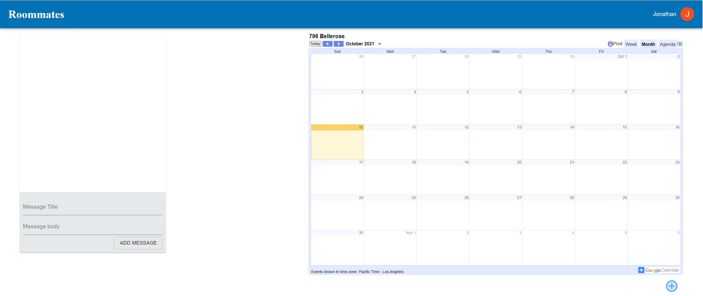

# Adding event to calendar
1. Click the circled button on the bottom right of the calendar to open the add task menu
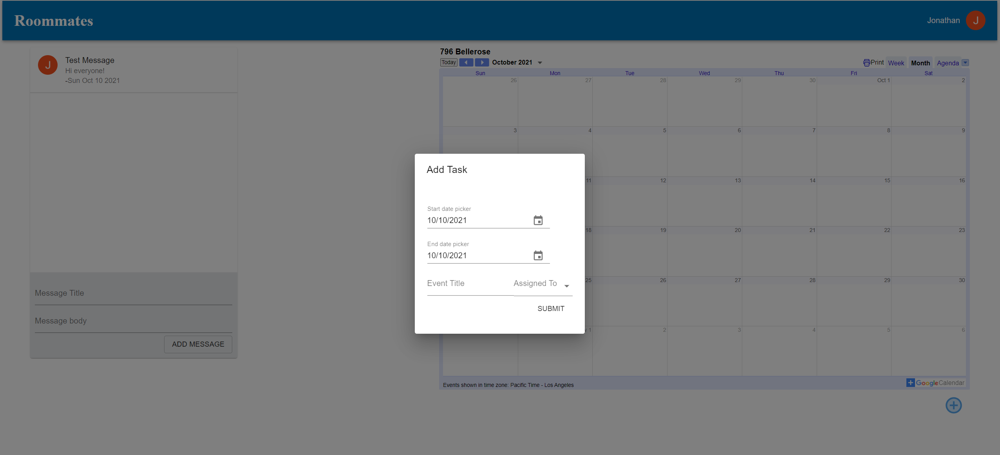
2. Select start date, end date, name of event, and who it is assigned to (optional) 
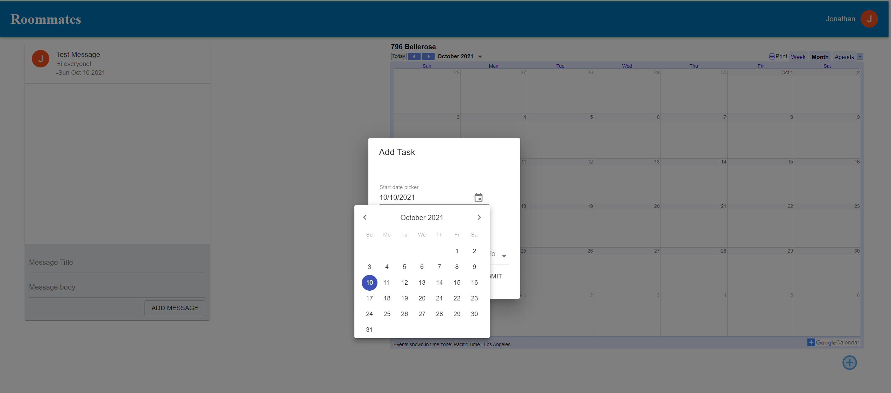
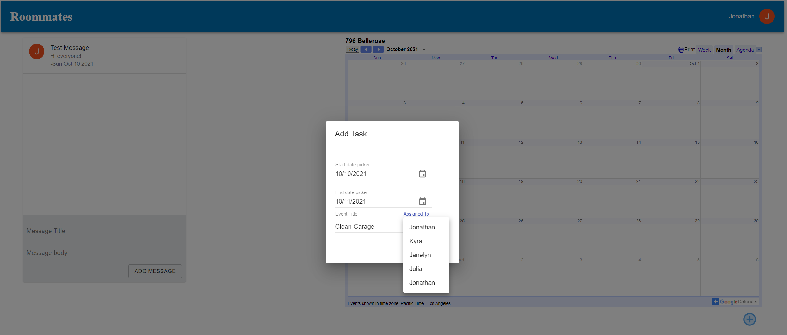
3. Refresh the page and event will appear on household calendar. Everyone in the household can see the event
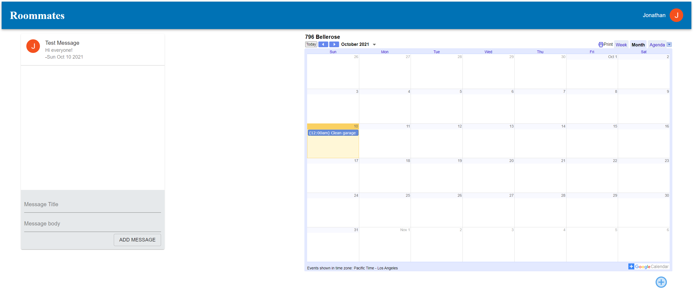


# Account page view for household owner
### Only the owner will have this view. The owner options are in the topmost section
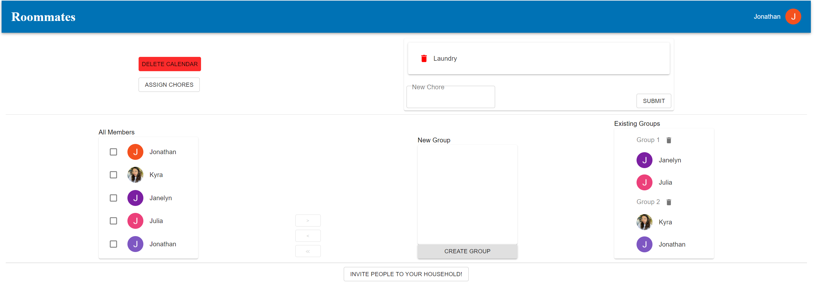
## Assigning chores
### The goal is to fairly rotate chores between everyone in the household
1. Open the assign chores menu by clicking Assign Chores button 
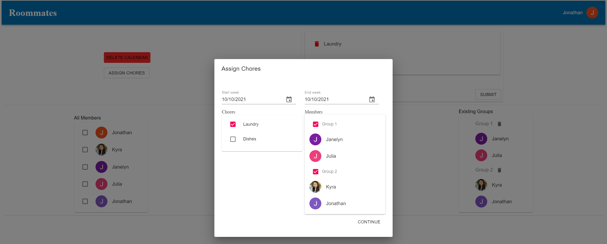
    * Users can click on the chores that they want to be assigned and the groups that will be included in the assigning process.
    * If start week and end week are the same, the chores will only be assigned for one week. 

2. Confirmation dialog
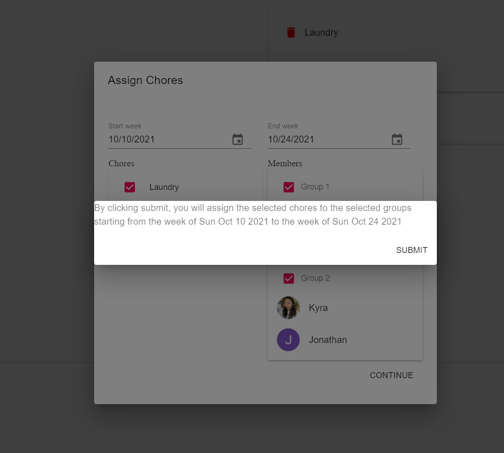
3. Chores now appear in the shared google calendar
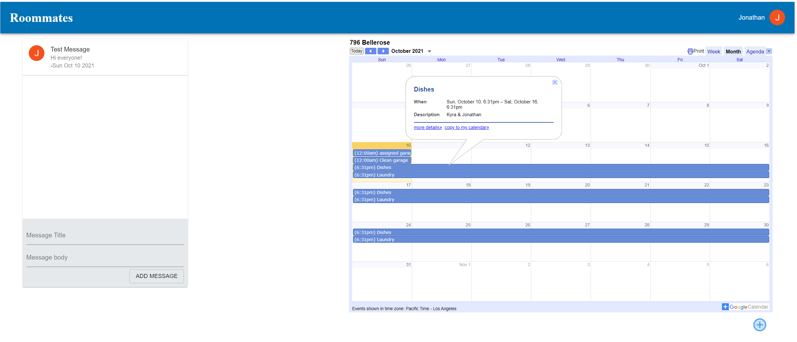

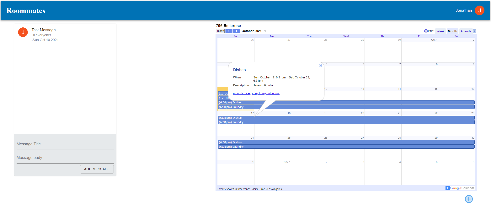


# Account page view for members of household
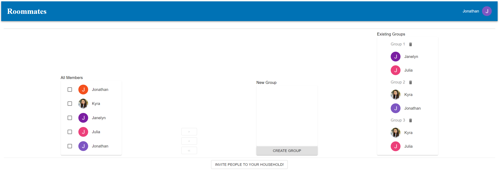


# Inviting people to your household
1. Click on invite housemate button which will reauthenticate user and redirect to invite page. Reauthentication is used to refresh the access token needed to change the calendar access control and allow invited party to make changes.
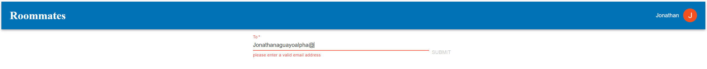

2. Completed form input

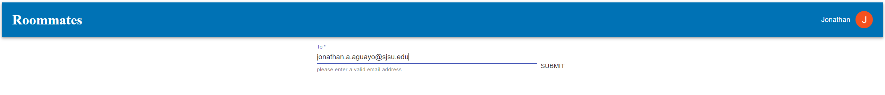

3. Success alert
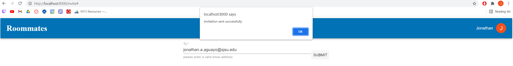

4. Google will send party an automated message saying that a new google calendar has been shared with them.
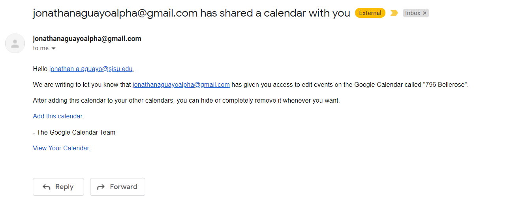

5. Email sent by room8tes email messenger

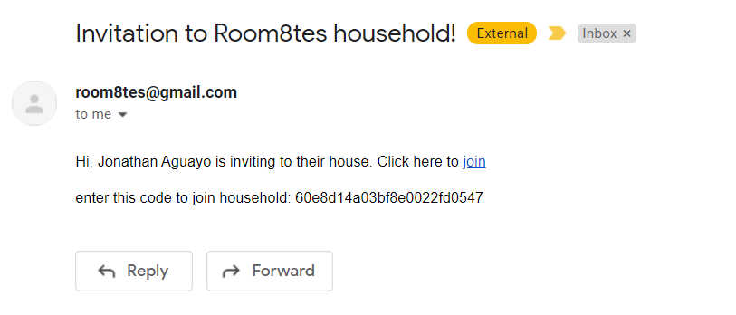

6. Invited party clicks the join link and enters the household ID mentioned in the email to join the household.
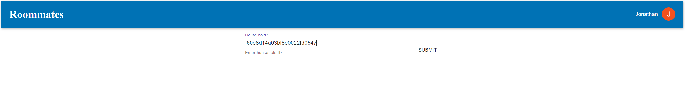

